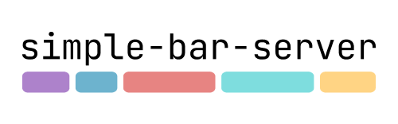

# 

A server for [simple-bar](https://github.com/Jean-Tinland/simple-bar) that enables communication with its data widgets and allow them to be refreshed or toggled with simple `curl` commands.

[Website](https://www.jeantinland.com/toolbox/simple-bar-server) • [Documentation](https://www.jeantinland.com/en/toolbox/simple-bar-server/documentation)

> [!NOTE]
> There are no external call to any API, it is just a local small node.js server on which [simple-bar](https://github.com/Jean-Tinland/simple-bar)'s components will be able to connect to via websockets.
> Check `index.js` file to see how it works.

**Notice: As I am working simultaneously on a lot of projects, things here may seem to move slowly but they are still in progress. I'm always monitoring my notifications and messages, so if you have any questions or want to chat about anything, feel free [to reach out](https://www.jeantinland.com/contact/)!**

## Features

- Refresh, toggle, enable or disable simple-bar widgets
- Refresh yabai spaces, windows, and displays simple-bar widgets
- Refresh simple-bar' skhd mode indicator
- Refresh AeroSpace spaces widget
- Send notifications (missives) for simple-bar to display

## Installation

Clone this project anywhere on your computer:

```bash
git clone https://github.com/Jean-Tinland/simple-bar-server.git
```

You'll find the full installation guide in the [documentation](https://www.jeantinland.com/toolbox/simple-bar-server/documentation/installation/).

## Status

This project only works with the latest version of [simple-bar](https://github.com/Jean-Tinland/simple-bar). Feel free to open an issue if you find a bug or have a feature request.


